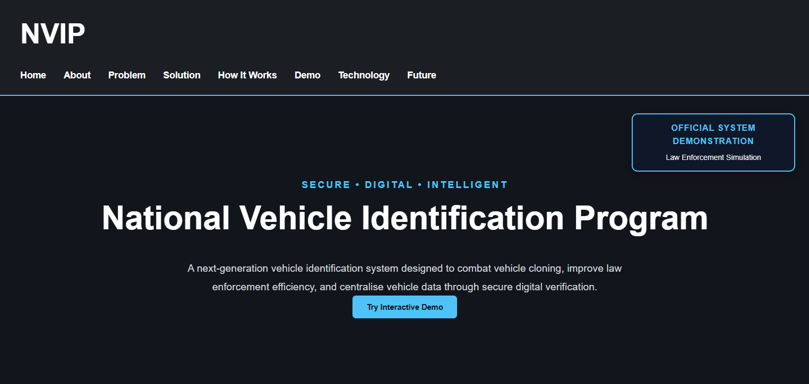
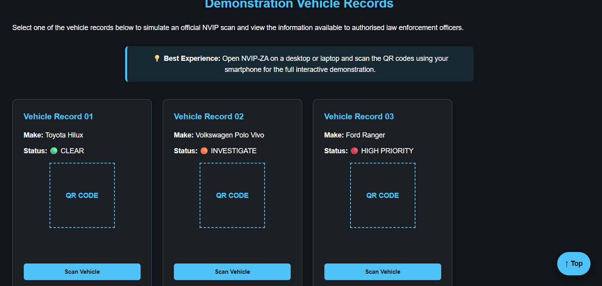
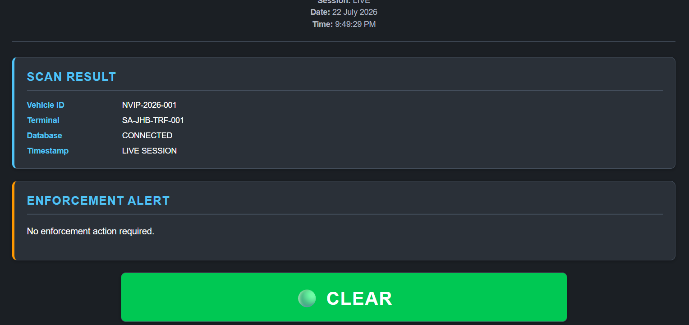
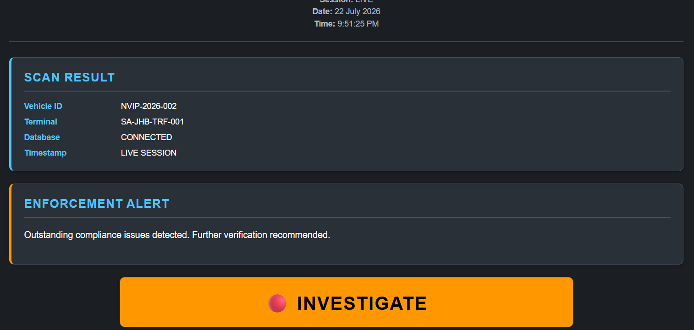
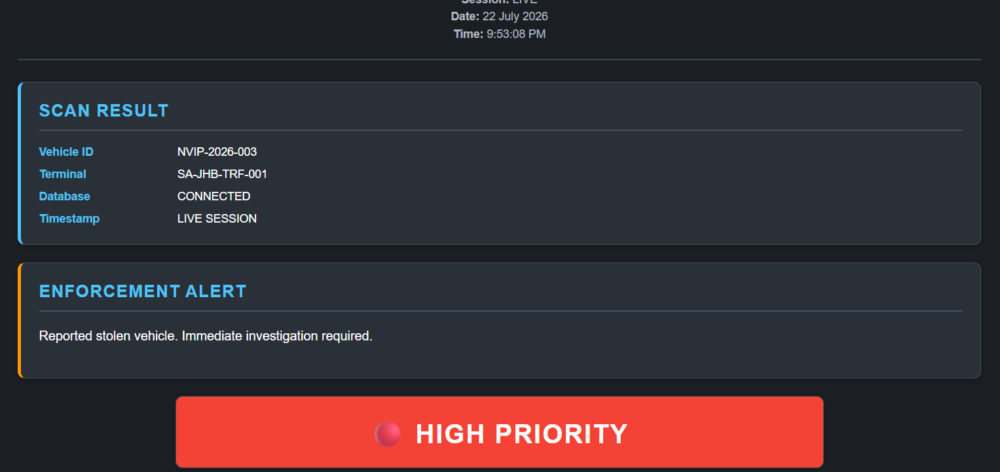

# 🚔 National Vehicle Identification Program (NVIP-ZA)

> **Secure • Digital • Intelligent**



---

## 🌍 Live Demonstration

Experience the live project here:

**https://butiza-hub.github.io/NVIP-ZA/**

---

## 🚧 Project Status

**Status:** Active Development

NVIP-ZA is an actively developed portfolio project that demonstrates how modern web technologies can be used to simulate a secure digital vehicle identification system for law enforcement environments.

---

## 📖 About NVIP-ZA

The National Vehicle Identification Program (NVIP-ZA) is a front-end simulation of a modern digital vehicle identification system designed to demonstrate how QR-code technology can improve vehicle verification and support law enforcement workflows.

The application allows users to simulate scanning vehicle records, review dynamic vehicle information, and experience how digital identification technologies could assist authorised officers during roadside inspections.

Although this version is currently a front-end demonstration, the project has been designed with future expansion towards a full-stack application incorporating databases, authentication, APIs, and real-time data.

---

## 📱 Best Demonstration Experience

> **For the best interactive demonstration, open NVIP-ZA on a desktop or laptop and scan the QR codes using your smartphone.**

This provides the intended user experience by simulating how a traffic officer could scan a vehicle's QR code to access its digital record.

---

## ✨ Current Capabilities

- 🚔 Interactive law enforcement simulation
- 📱 QR-code vehicle demonstration workflow
- 🚗 Three simulated vehicle records
- 🟢 Dynamic status indicators (Clear, Investigate, High Priority)
- 📄 Vehicle information dashboard
- 👤 Owner information display
- 🛡 Insurance status verification
- ⚖ Outstanding fines overview
- 🚨 Enforcement action recommendations
- 🕒 Live date and time display
- ⬆ Floating "Back to Top" navigation
- 📱 Responsive design for desktop and mobile devices

---

## 🛠 Technology Stack

### Front-End

- HTML5
- CSS3
- JavaScript (ES6)

### Development Tools

- Visual Studio Code
- Git
- GitHub
- GitHub Pages

---

## 📂 Project Structure

```
NVIP-ZA/
│
├── css/
│   ├── dashboard.css
│   ├── responsive.css
│   └── styles.css
│
├── images/
│   ├── hero/
│   ├── icons/
│   ├── qr/
│   ├── screenshots/
│   └── vehicles/
│
├── js/
│   ├── app.js
│   ├── dashboard.js
│   ├── main.js
│   ├── qr.js
│   └── vehicles.js
│
├── index.html
├── vehicle.html
└── README.md
```

---

## 📸 Visual Walkthrough

### 🏠 1. Landing Page

The landing page introduces the National Vehicle Identification Program (NVIP-ZA), providing visitors with an overview of the project, its objectives, and access to the interactive demonstration.


---

### 🚔 2. Interactive Demonstration

Visitors can select from three simulated vehicle records, each representing a different law enforcement scenario. This demonstrates how officers would access vehicle information through the NVIP system.



---

### 🟢 3. Vehicle Record – CLEAR

A normal vehicle record displaying valid registration, active insurance, no outstanding fines, and no enforcement action required.



---

### 🟠 4. Vehicle Record – INVESTIGATE

An example vehicle requiring additional verification due to compliance concerns. Officers are advised to conduct further investigation.



---

### 🔴 5. Vehicle Record – HIGH PRIORITY

A high-priority enforcement scenario demonstrating how the system highlights serious alerts requiring immediate law enforcement attention.



---